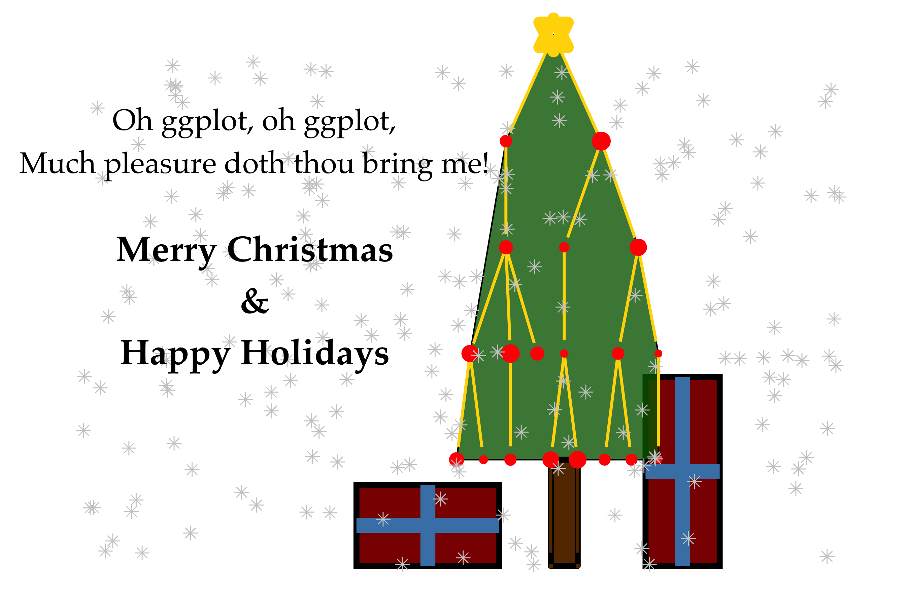

# ggplot_christmas
A christmas card made with ggplot2

## Motivation
On/around Christmas Eve 2019, I saw <a href="https://xkcd.com/835/" target="_blank">this old XKCD comic</a>.

Since I was working with visualizing network data at the time, I realized that I could probably render the tree in the comic in ggplot2 relatively easily.  Over the course of a few hours, it evolved into this Christmas card.

## Reasons why this isn't completely stupid
I mean, maybe mostly, but this effort is not completely ridiculous.  Feel free to disagree, though you are wrong if you do.

It's a good exercise for learning advanced ggplot2 techniques, including:
   * Plotting networks using `igraph`, `network`, and `ggnetwork` packages
   * Controlling order of layers by using `subset`
   * Determining plotting locations of some elements based on other elements (presents under the tree)
   * Supervised randomness of locations of certain elements (presents and snowflakes)
   * Implementing different color scales for different `geom`s using `ggnewscale`

### Output

